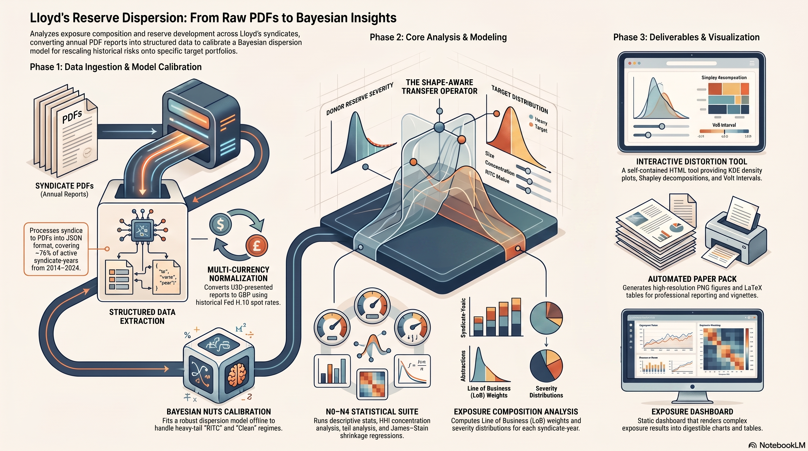

# Lloyd's Exposure Composition & Reserve-Development Dispersion



Analyses the exposure composition and prior-year reserve development (PYD) of Lloyd's
syndicates, using structured data extracted from syndicate annual reports (PDFs → JSON). The
core deliverable is a **robust Bayesian pooling dispersion model** and a **scenario-transfer
operator** that rescales historical reserve movements onto a user-specified target portfolio
(size, concentration and target tail regime: clean by default, RITC-affected, or a preserve-donor-regime diagnostic).

## Overview

- **`run_analysis.py`** — reads syndicate JSON extractions from `pdf_extraction/`, classifies
  data quality, computes line-of-business (LoB) weights, severity distributions and HHI, runs
  the analyses, and emits `exposure_results.json` plus the `paper_pack/` tables and figures and
  the `vignettes/` bundles.
- **`calibrate_dispersion_ritc.py`** — fits the dispersion model offline (Bayesian NUTS) and
  writes `dispersion_calibration_ritc.json` + `dispersion_posterior_draws_ritc.npz`, consumed by
  the pipeline and the vignette VaR scripts. (`calibrate_dispersion.py` fits the no-RITC-regime
  variant used only as a comparison baseline.)
- **`distortion_tool.html`** — self-contained portfolio basis-transfer tool (generated). The user
  enters a target LoB mix, reserve size and target tail regime --- clean (the default), RITC-affected, or a diagnostic that preserves each donor's own regime; the tool quantile-maps every donor from its own tail index onto the selected target's and applies the dispersion transfer
  operator to the donor pool and shows raw vs target-basis distributions, summary statistics, a
  three-player Shapley decomposition (tail regime, size, concentration --- all eight
  coalitions, summing exactly to target minus raw) and per-syndicate-year worked examples.
  All data and dependencies are embedded — open in any browser, no server required.
- **`pdf_extraction/exposure_analysis.html`** — static dashboard that loads
  `exposure_results.json` and renders tables/charts (no computation of its own).

## The model (summary)

For syndicate *i* in reporting year *t*, severity `S = PYD / opening_reserves`:

```
S_it ~ Student-t(nu_it, 0, sigma_it)
sigma_it = exp( s_t + beta_RITC * 1[RITC] )
           * sqrt( sigma_undiv^2 + sigma_div^2 * [ (R/R_ref)(1/H)^gamma ]^{2(k-1)} )
nu_it    = nu_clean                      (clean years)
         = nu_clean * exp(-lambda_RITC)  (RITC years — heavier tail)
```

with `mu = 0` fixed, pooling exponent `k ∈ [0.5, 1]`, concentration via the effective line count
`n_eff = 1/H`, a positive undiversifiable floor `sigma_undiv`, a reporting-year shared shock
`s_t`, and a Student-t tail split into a **clean** and an **RITC** regime (external
reinsurance-to-close is modelled as a heavier tail plus a fitted log-scale shift
`beta_RITC`; the transfer operator omits that scale shift — a structural simplification
worth about 3% of the vignette stresses, not an established zero; see
[docs/current-results.md](docs/current-results.md)).

Headline fit (n=790, 11 reporting years, single-currency GBP data — see
[docs/fx-conversion.md](docs/fx-conversion.md)): `k ≈ 0.61`, `gamma ≈ 0.24`,
`sigma_undiv ≈ 0.021`, `nu_clean ≈ 2.43`, `nu_ritc ≈ 1.55`, `P(nu_ritc < nu_clean) = 0.99`.

## The transfer operator

The operator applies the fitted base scale law `sigma(R,H)` and the two fitted tail
indices; it omits the fitted RITC scale multiplier `exp(beta_RITC * 1[RITC])` (a measured
~3% structural simplification) and carries the donor's realised year effect in the
observed severity rather than re-drawing it. It is **shape-aware**: a donor severity at
`(R_s, H_s)` transfers to a target `(R_t, H_t)` by

```
S_adj = sigma(R_t,H_t) * F_inv[ nu_t ]( F[ nu_s ]( S_src / sigma(R_s,H_s) ) )
```

where `F` is the Student-t CDF. When `nu_s = nu_t` this collapses to the pure rescale
`S_src · sigma(R_t,H_t)/sigma(R_s,H_s)`; when the donor is an RITC year and the target is clean,
it **de-RITCs** the donor — thinning its heavy tail to the clean-composition tail. This is an
upstream distributional adjustment, not a tail-fitting or capital-setting method: the
regime step applies the two fitted Student-t indices; it does not fit a tail to the
target or set capital.

## Statistical analyses

- **N0** — descriptive statistics and data-quality classification
- **N1** — LoB weight distributions and concentration (HHI)
- **N2** — severity distributions and tail analysis
- **N3** — panel regression of PYD on LoB weights (RE-GLS with James–Stein shrinkage)
- **N4** — bootstrap and leave-one-out robustness checks
- **Dispersion model** — the robust Bayesian pooling model above (size, concentration, floor,
  heavy tails, RITC tail regime), calibrated by `calibrate_dispersion_ritc.py`

## Project structure

All analysis scripts live in `src/` and are run from the repo root as
`python src/<script>.py`. Generated artifacts and reference inputs are organised into
subfolders:

```
├── src/                            # All analysis scripts (run as `python src/<name>.py`)
├── README.md                       # Start here
├── docs/current-results.md         # Current fitted values (GENERATED)
├── scaling_analysis_writeup.md     # ARCHIVE - historical development record
├── distortion_tool.html            # Portfolio basis-transfer tool (generated deliverable)
├── requirements.txt                # Direct dependency constraints
├── requirements.lock               # Clean Python 3.12.6 environment (transitives pinned)
│
├── model/                          # Shared pipeline artifacts (generated)
│     exposure_results.json           – results bundle emitted by run_analysis.py
│     dispersion_calibration*.json    – calibrated parameters (ritc / systemic / … )
│     dispersion_posterior_draws*.npz – posterior draws
│     fx_rates_h10.json               – Fed H.10 GBP/USD spot rates
├── results/                        # Per-analysis output JSONs (*_results.json, worklist)
├── figures/                        # Standalone-script figures + project infographic
├── assets/                         # HTML template + inlined Chart.js for the tool
├── data/                           # Reference inputs (market_active_syndicates, inception years)
│
├── pdf_extraction/                 # Input syndicate JSONs + ritc_scan/currency_scan + dashboard
├── vignettes/                      # Generated vignette bundles
├── paper_pack/                     # Generated paper figures and LaTeX tables
├── specifications/                 # Analysis and vignette specifications
└── docs/                           # Methodology notes, data provenance, referee checks
```

Each script anchors its paths to the repo root (`Path(__file__).resolve().parent.parent`),
so it reads/writes these subfolders automatically regardless of the working directory — no
configuration needed.

## Setup

The recorded and supported environment uses Python 3.12.6. Create a project-specific
environment and install the complete project lock, which pins all transitive
requirements:

```bash
python3.12 -m venv .venv
source .venv/bin/activate              # Windows: .venv\Scripts\activate
python -m pip install --upgrade pip
python -m pip install -r requirements.lock
```

## Reproducing the paper's results

```bash
python -m pip install -r requirements.lock
python reproduce.py --check     # environment and committed inputs, no fitting
python reproduce.py --list      # every script in the manifest, in order, with runtimes
python reproduce.py             # run everything (no C++ toolchain needed)
```

`reproduce.py` runs the calibration, then the referee checks, then `run_analysis.py`,
in the order they depend on each other, and reports which succeeded. Every fitting
script seeds itself. What reproduction means here is stated precisely, because the
verifier checks exactly this: every output DECLARED by a manifest step is compared with
the committed version -- `.npz` and other binaries byte for byte, `.json` after
excluding only the documented `runtime_seconds` field. A recorded pass writes
`reproduce-run-report.json` (committed): the commit, command, environment, per-script
status and per-output SHA-256, so the claim is auditable from a clean clone rather
than resting on a local, gitignored stamp.

Use `python reproduce.py --verify` rather than `git status` to check a run. Without
either a local run stamp or a committed run report, an untouched checkout proves
nothing. This repository includes a committed calibration report, so `--verify`
validates that historical report in a clean clone and identifies it as partial: it
prints how many of the manifest's scripts the recorded run covers, marks the run
PARTIAL, and states that the outputs of the scripts it did not run are not evidence
of reproduction. It does not rerun the calibration. The five calibration `.json` outputs
record `runtime_seconds`, which is wall-clock and varies, so `git status` flags them as
modified when every fitted number in them is identical; `--verify` excludes exactly
that field, byte-compares everything else (including the `.npz` posterior draws, which
the old verifier's `.json` filter could not see), and fails on any changed output that
no ran script declared.

The calibration stage has been rerun as a recorded pass from a clean committed
state. `reproduce-run-report.json` (committed) records the commit, a
`worktree_dirty_src` flag, the environment, and per-output hashes -- canonical
SHA-256 for JSON (volatile fields excluded), byte SHA-256 for binaries -- and
`--verify` VALIDATES that report against history: a dirty recorded run is rejected,
and every recorded hash is checked against the blob at the recorded commit. In a
clean clone with no local run, that validation is the whole verdict; comparing an
untouched tree with its own `HEAD` proves nothing and is not done. The other stages
have not been run end to end in one pass, so `--verify` prints the coverage --
`N of M manifest scripts recorded as run`, with M read from the manifest itself -- and marks the verdict `PASS (PARTIAL
run)` rather than implying more. A verdict without its coverage was the earlier
defect: the clean-clone path printed `PASS` alone while this file claimed it said
partial.

The environment is machine-enforced: `requirements.lock` pins every package
(transitives included) at the versions of record. `--check` enforces Python 3.12.6
and parses every PEP 508 entry, including extras, direct URLs and VCS references; the
run report records the material versions.

This setup was validated on 31 August 2026 in a newly created Python 3.12.6 virtual
environment: installation from `requirements.lock`, `reproduce.py --check`, clean-clone
`--verify`, and the test suite all passed (270 passed, 14 skipped). A calibration smoke
run of `calibrate_dispersion.py` completed 6,000 posterior draws with zero divergences
and maximum R-hat 1.000. This does not turn the historical partial run report into a
full-manifest reproduction; the distinction above remains deliberate.

That test count is not typed. `python src/record_tests.py` runs the suite, writes
`tests-run-report.json` (counts, collected total, commit, dirty flag, environment)
and stamps the number above from what it observed; `--check` then fails if any stated
count disagrees with the record, or if the suite has changed size since the record was
written -- a record nothing revalidates goes stale exactly the way the prose it
replaced did. The previous count was typed by hand and was wrong by one test on the
day it was written.

It does **not** re-run the PDF extraction, which needs the source reports and paid LLM
API access; its output is committed as `model/exposure_results.json`. Everything
downstream of that file is *re-runnable* from this checkout through the manifest;
what has been *demonstrated* is the recorded partial clean run described above
(`--verify` prints its exact coverage), and the remaining stages have not been run
end to end in one pass.

Individual steps still work on their own:

```bash
python src/calibrate_dispersion_ritc.py   # (re-)fit the dispersion model when the data change
python src/run_analysis.py                # the analysis pipeline and paper-pack outputs
```

`run_analysis.py` reads all `pdf_extraction/syndicate_*_*.json` files and writes:

- `model/exposure_results.json` — structured results for the dashboard
- `paper_pack/` — figures (PNG) and tables (LaTeX)
- `vignettes/` — worked-example bundles for two hypothetical syndicate vignettes
- `distortion_tool.html` — self-contained portfolio basis-transfer tool

Vignette VaR intervals and EVT cross-checks:

```bash
python src/vignette_uncertainty.py && python src/gpd_var_uncertainty.py && python src/bayesian_gpd.py
python src/appendix_c_tail_comparison.py
```

### Data provenance

The structured inputs are produced by a separate extraction project,
[lloyds-reserve-stress-testing](https://github.com/colinpriest/lloyds-reserve-stress-testing).
See [docs/data-provenance.md](docs/data-provenance.md) for what is imported and
[docs/appendix-data-audit.md](docs/appendix-data-audit.md) for the coverage audit
(~76% of active syndicate-years, 2014–2024).

All monetary amounts are **GBP millions**: USD-presented reports (26% of observations) are
converted at the reporting-date Fed H.10 spot rate, with per-report currency provenance from
the source PDFs — see [docs/fx-conversion.md](docs/fx-conversion.md), `currency_scan.py`
(→ `pdf_extraction/currency_scan.json`) and `fetch_h10_rates.py` (→ `fx_rates_h10.json`).

### Dashboard

Open `pdf_extraction/exposure_analysis.html` in a browser and load `exposure_results.json`.

### Portfolio basis-transfer tool

Open `distortion_tool.html` directly in a browser. All data (789 donors) and Chart.js are
embedded — no server, no additional files, no internet connection required. It shows KDE density
plots of raw vs target-basis PYD distributions, the adverse-tail survivor function, a statistics
table with raw-to-adjusted deltas, a three-player Shapley waterfall of VaR99.5 (tail-regime,
reserve-size and concentration effects, summing exactly to target minus raw), and
click-through worked examples.
